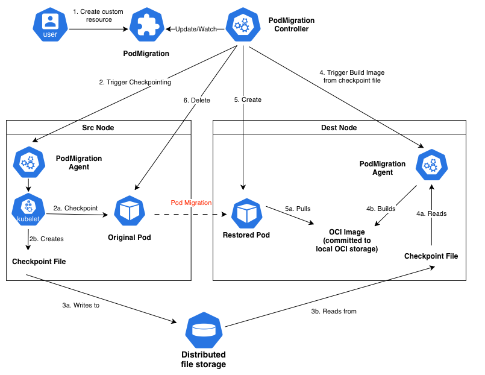

# Live Pod Migration Controller - Technical Overview

## Executive Summary
The Live Pod Migration Controller enables **live migration of running pods between Kubernetes nodes** using CRIU (Checkpoint/Restore In Userspace) technology to preserve process state, memory contents, and file descriptors. This **CRD-driven solution** orchestrates cross-node pod migration through a distributed control-plane/agent architecture with shared storage.

## Architecture & Components

### Core CRDs (Custom Resource Definitions)
1. **PodMigration** (`lpm.my.domain/v1`)
   - Spec: `{podName: string, targetNode: string}`
   - Orchestrates the end-to-end migration workflow
   - Creates PodCheckpoint, monitors completion, triggers restoration

2. **PodCheckpoint** (`lpm.my.domain/v1`)
   - Spec: `{podName: string}`
   - Manages pod-level checkpoint operations
   - Creates ContainerCheckpoints for each container
   - Binds to PodCheckpointContent (cluster-scoped)

3. **ContainerCheckpoint** (`lpm.my.domain/v1`)
   - Spec: `{podName: string, containerName: string}`
   - Represents individual container checkpoint requests
   - Binds to ContainerCheckpointContent with artifact location

4. **PodRestore** (`lpm.my.domain/v1`)
   - Spec: `{podName: string, targetNode: string}` (targetNode is optional)
   - Manages the recreation of a pod from checkpoints
   - Bypasses node-agent image preparation if `targetNode` is empty

5. **PodCheckpointContent/ContainerCheckpointContent**
   - Cluster-scoped resources containing actual checkpoint artifacts
   - Stores `artifactURI` with format: `shared://<podUID>/<checkpointID>/<container>/dump.tar.zst`

### Checkpoint Agent (DaemonSet)
- **Deployment**: Privileged DaemonSet on all nodes (`checkpoint-agent:50051`)
- **gRPC Interface**: `CheckpointService` with methods:
  ```proto
  rpc Checkpoint(CheckpointRequest) returns (CheckpointResponse)
  rpc ConvertCheckpointToImage(ConvertRequest) returns (ConvertResponse)
  ```
- **Kubelet Integration**: Uses kubelet checkpoint API (`https://<node>:10250/checkpoint/<ns>/<pod>/<container>`)
- **TLS Authentication**: Mounts kubelet client certificates from `/etc/kubernetes/pki/`
- **Checkpoint Process**:
  1. Calls kubelet API with backoff retry (5 steps, 2s initial, 2x factor)
  2. Receives checkpoint tar file at `/var/lib/kubelet/checkpoints/`
  3. Copies to shared storage at `/mnt/checkpoints/<podUID>/<checkpointID>/`
  4. Returns artifact URI for controller consumption

### Shared Storage Design
```
/mnt/checkpoints/               # NFS mount (ReadWriteMany PVC)
├── <podUID>/                   # Pod-specific directory
│   └── <checkpointID>/         # Timestamp-based checkpoint
│       ├── <containerName>/    
│       │   ├── dump.tar.zst    # CRIU checkpoint (zstd compressed)
│       │   └── manifest.json   # Metadata
│       └── .checkpoint-complete # Completion marker
```
### Controllers (Reconciliation Logic)

**PodMigrationController**:
1. Pre-pulls images on the target node via an ephemeral pull pod.
2. Creates PodCheckpoint for source pod and waits for checkpoint completion (`Ready=true`).
3. Creates PodRestore CR to orchestrate pod recreation.
4. Updates migration status to `Completed` when PodRestore succeeds.

**PodCheckpointController**:
1. Lists containers in target pod.
2. Creates ContainerCheckpoint for each container.
3. Monitors all checkpoints for completion.
4. Creates PodCheckpointContent when all containers are checkpointed.

**ContainerCheckpointController**:
1. Calls agent gRPC service on pod's node.
2. Receives artifact URI from agent.
3. Creates ContainerCheckpointContent with artifact location.
4. Updates checkpoint status to `Ready`.

**PodRestoreController**:
1. Validates checkpoint artifact existence.
2. Restores the pod with annotation: `io.kubernetes.cri-o.checkpoint-restore: <artifactURI>`.
3. Handles owner reference mapping (e.g., StatefulSet or Deployment logic).
4. Relies on the standard scheduler if `targetNode` is omitted.

## High-Level Migration Workflow




## Key Technical Specifications

**CRIU Integration**:
```bash
criu dump --tree $PID --images-dir /checkpoint \
  --leave-running --file-locks --tcp-established
```

**CRI-O Restore Annotation**:
```yaml
io.kubernetes.cri-o.checkpoint-restore: "shared://<podUID>/<checkpointID>/<container>/dump.tar.zst"
```

**Agent gRPC Message**:
```protobuf
message CheckpointRequest {
  string pod_namespace = 1;
  string pod_name = 2;
  string container_name = 3;
  string pod_uid = 4;
}
```

## Conclusion
The Live Pod Migration Controller demonstrates a **production-viable approach** to stateful pod migration in Kubernetes, leveraging standard APIs and container runtime features without invasive modifications. The architecture successfully preserves application state across nodes, though complex networking scenarios (like Flink) require additional CRIU configuration. This foundation enables advanced use cases like node maintenance, resource optimization, and disaster recovery while maintaining application continuity.