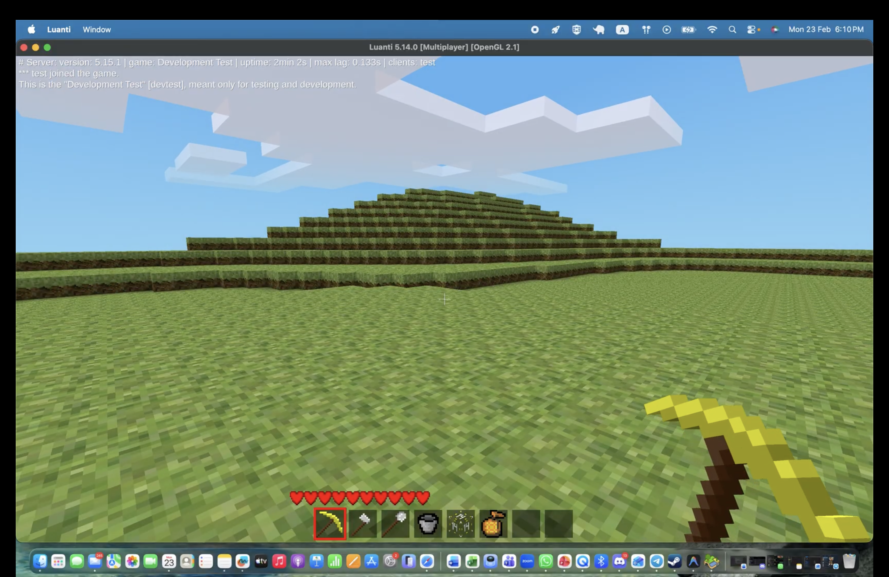

# Live Pod Migration Controller

A Kubernetes-native controller that enables live migration of running pods between cluster nodes using CRIU (Checkpoint/Restore In Userspace) technology. The system performs checkpoint operations on source nodes and restores pod state on destination nodes while preserving process memory, file descriptors, and application state.

## Description

The Live Pod Migration Controller implements a complete control-plane and node agent architecture for migrating stateful workloads across Kubernetes cluster nodes. It uses a phased approach and delegates specialized tasks to dedicated controllers. It provides three main capabilities:

**🔄 Container-Level Checkpointing**: Create point-in-time snapshots of individual containers within pods, capturing process state, memory contents, and file descriptors.

**📦 Pod-Level Migration**: Orchestrate migration of entire pods by automatically checkpointing all containers and coordinating the restore process on destination nodes.

**🏗️ Distributed Architecture**: A control-plane operator manages the migration lifecycle while privileged node agents perform the actual checkpoint/restore operations via secure gRPC communication.

### Key Features

- **Process State Preservation**: Maintains running processes, memory contents, and file descriptors across migration.
- **Kubernetes-Native**: Uses standard CRDs and APIs, follows Kubernetes design patterns.
- **Cross-Node Migration**: Supports pod movement between any nodes in the cluster.
- **Scheduler-Driven Placement**: Supports migration without a pre-defined target node, allowing the standard Kubernetes scheduler to determine the optimal destination node.
- **CRIU Integration**: Leverages CRIU checkpoint/restore technology with OCI image packaging.

### Architecture Components

- **PodMigration Controller**: Orchestrates the end-to-end migration lifecycle (phases: PrePullImages, Pending, Checkpointing, Restoring, etc.).
- **PodCheckpoint Controller**: Manages pod-level checkpoint operations across multiple containers.
- **ContainerCheckpoint Controller**: Handles individual container checkpoint lifecycle.
- **PodRestore Controller**: Manages the restoration of a pod from checkpoints on a target node.
- **Checkpoint Agent**: Privileged DaemonSet that interfaces with kubelet checkpoint API and CRIU.
- **Storage Integration**: Pluggable storage backends for checkpoint artifacts (local, PVC, object storage).

### Use Cases

- **Node Maintenance**: Drain nodes for updates while preserving long-running job state.
- **Resource Optimization**: Move workloads to optimize cluster resource utilization.
- **Disaster Recovery**: Create portable checkpoints for cross-cluster recovery scenarios.
- **Development/Testing**: Capture and replay application states for debugging and testing.

## Demo

🎥 **Live Pod Migration in Action** - Watch real-time process state preservation across Kubernetes nodes:

[](https://drive.google.com/file/d/188jahZqDNSb7lUr4gAqEAxEzfgqKXZvc/view?usp=sharing)

*Watch the complete migration workflow above.*

## Quick Start

For a complete setup guide including CRIU configuration and testing instructions, see [README-TESTING.md](./README-TESTING.md).

### Basic Workflow

1. **Create a pod migration** to move a running pod between nodes:
   ```yaml
   apiVersion: lpm.my.domain/v1
   kind: PodMigration
   metadata:
     name: my-migration
   spec:
     podName: my-app-pod
     targetNode: target-node-name # Optional: omit for scheduler-driven placement
   ```
2. **Monitor progress** with `kubectl get podmigration my-migration`. You will see the migration progress through phases such as `PrePullImages`, `Pending`, `Checkpointing`, `Restoring`, and `Succeeded`.
3. **Verify restored pod** maintains application state from the checkpoint.

## Project Structure

```
├── api/v1/                          # CRD definitions and Go types
├── cmd/checkpoint-agent/            # Node agent binary
├── internal/
│   ├── controller/                  # Controller reconciliation logic
│   └── agent/                       # Agent client and gRPC interfaces
├── config/
│   ├── crd/bases/                   # Generated CRD manifests
│   ├── agent/                       # DaemonSet and RBAC for agents
│   └── samples/                     # Example resources
├── vagrant/                         # Development environment setup
└── README-TESTING.md                # Comprehensive testing guide
```

## Documentation

- **[Technical Overview](./OVERVIEW.md)**: Detailed technical architecture, CRDs, and workflow.
- **[Testing Guide](./README-TESTING.md)**: Complete setup, testing, and troubleshooting instructions.
- **[Storage Plan](docs/CHECKPOINT-STORAGE-PLAN.md)**: Design for shared storage implementation.
- **API Reference**: Generated CRD documentation (see `config/crd/bases/`).

## Getting Started

For complete installation, configuration, and testing instructions, see **[README-TESTING.md](./README-TESTING.md)**.

### Prerequisites
- Kubernetes cluster with CRIU 4.1.1+ support
- CRIO container runtime with checkpoint feature enabled
- Shared storage (NFS) for cross-node checkpoint access

## Roadmap

### Current Features (v1.0)
- ✅ **Live Pod Migration**: Complete cross-node migration with process state preservation.
- ✅ **Container Checkpointing**: Individual container checkpoint/restore via kubelet API.
- ✅ **Pod-Level Migration**: Multi-container pod migration orchestration.
- ✅ **Pod Restoration**: Dedicated controller for orchestrating pod rebuilds from checkpoints.
- ✅ **Scheduler-Driven Placement**: Optional target node allowing native kube-scheduler logic.
- ✅ **OCI Image Integration**: Checkpoint packaging as standard OCI images.
- ✅ **CRI-O Integration**: Automatic checkpoint restoration via container runtime annotations.

### Planned Features  
- 🔄 **Incremental Checkpoints**: Delta-based storage for large containers.
- 🔄 **Cross-Cluster Migration**: Portable checkpoints for disaster recovery.
- 🔄 **Performance Optimization**: Compression, deduplication, and streaming.
- 🔄 **Network State Migration**: Advanced TCP connection restoration.

### Long-term Vision
- 🎯 **Production Hardening**: HA storage, encryption, multi-tenancy.
- 🎯 **Advanced Scheduling**: Migration-aware pod placement.
- 🎯 **Observability**: Comprehensive metrics and distributed tracing.
- 🎯 **Cloud Integration**: Native support for cloud storage backends.

## Contributing

We welcome contributions! This project is part of CP4101 coursework but aims to be a production-ready Kubernetes extension.

### Development Setup
1. Clone the repository
2. Set up the Vagrant development environment: `cd vagrant && vagrant up`
3. Follow the [Testing Guide](./README-TESTING.md) for local development

### Areas for Contribution
- **Storage Backends**: Implement additional checkpoint storage options.
- **Testing**: Expand test coverage and performance benchmarks.
- **Documentation**: Improve API documentation and user guides.
- **Performance**: Optimize checkpoint/restore performance.
- **Security**: Enhance multi-tenancy and encryption features.

For detailed development and testing instructions, see [README-TESTING.md](./README-TESTING.md).

## License

Copyright 2025-2026.

Licensed under the Apache License, Version 2.0 (the "License");
you may not use this file except in compliance with the License.
You may obtain a copy of the License at

    http://www.apache.org/licenses/LICENSE-2.0

Unless required by applicable law or agreed to in writing, software
distributed under the License is distributed on an "AS IS" BASIS,
WITHOUT WARRANTIES OR CONDITIONS OF ANY KIND, either express or implied.
See the License for the specific language governing permissions and
limitations under the License.
